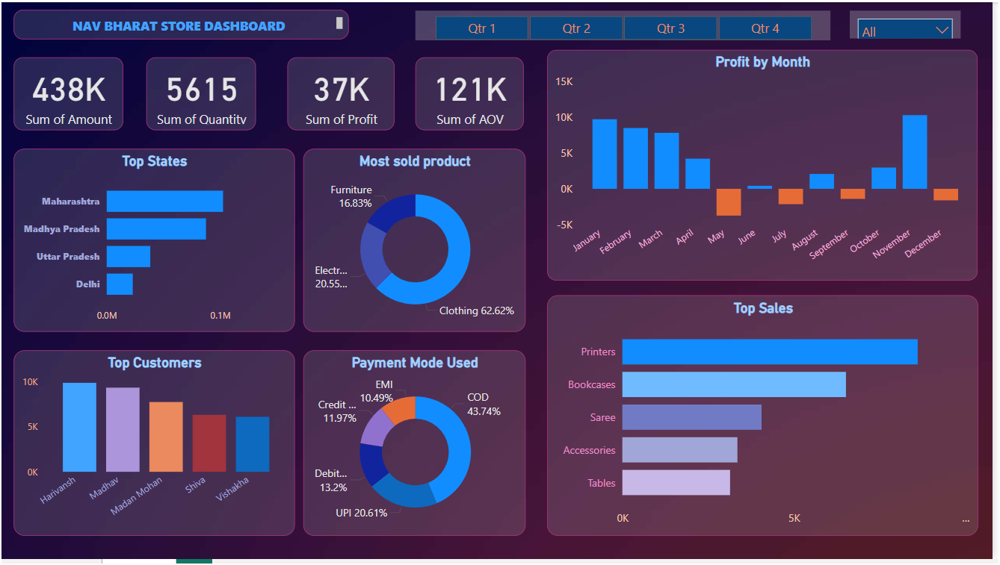

# Nav Bharat Khadi Store Dashboard

## Project Overview
This project involves creating an interactive and insightful Power BI dashboard for Nav Bharat Khadi Store. The dashboard provides a comprehensive view of various key metrics and statistics to help in effective decision-making and business management.

## Dashboard Preview

## Features
- **Sales Summary**: Displays the total amount, quantity, profit, and average order value.
- **Top States**: Shows the top states contributing to the sales.
- **Most Sold Product**: Pie chart illustrating the distribution of products sold.
- **Profit by Month**: Bar chart displaying monthly profit.
- **Top Customers**: Highlights the top customers based on their purchase value.
- **Payment Mode Used**: Pie chart showing the distribution of different payment methods.
- **Top Sales**: Bar chart showcasing the top-selling items.

## Tools and Technologies
- Power BI for data visualization and dashboard creation.

## Demo
For a detailed demonstration, visit the [LinkedIn post](https://www.linkedin.com/posts/adarshkumar-choudhary-04380829a_powerbi-datamagic-businesssmart-activity-7140758643171287040-JSwr?utm_source=share&utm_medium=member_desktop).

- Adarsh Kumar Choudhary
